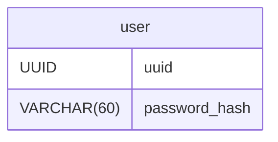

# MatchLab Database

Репозиторий содержит актуальную модель данных проекта MatchLab.

## ER-диаграмма

Нажмите на диаграмму, чтобы открыть её в полном размере.

## Содержимое

- `schema/matchlab.dbml` — основной источник истины
- `schema/matchlab.drawdb.json` — визуальное представление схемы для drawDB

## Принцип работы

Схема проектируется визуально в drawDB или редактируется напрямую в DBML.

Алгоритм внесения изменений:
1) загружаем `schema/matchlab.drawdb.json` в (DrawDB)[https://www.drawdb.app/editor]
2) вносим необходимые изменения
3) экспортируем DBML и JSON в директорию `schema` и заменяем прежнюю версию
4) экспортируем Mermaid схему и кладем в этот readme
5) пушим изменения в мастер
