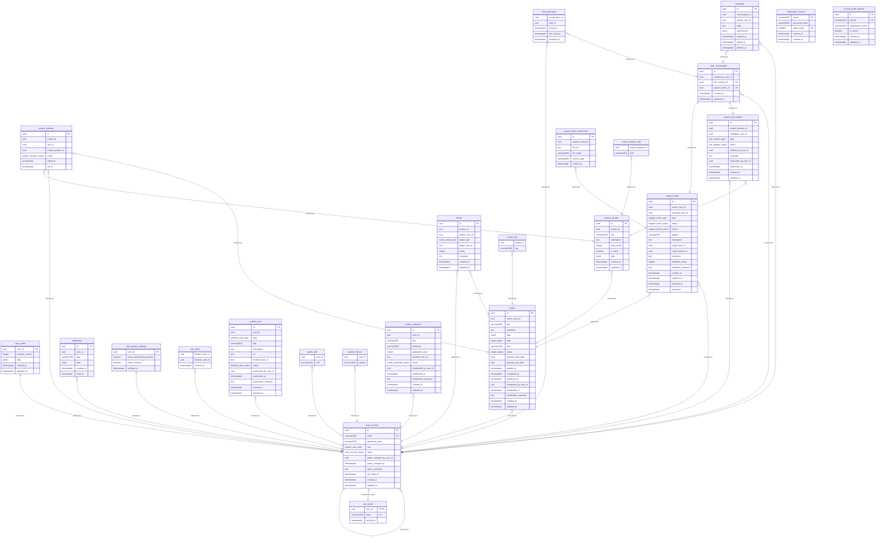

# MatchLab Database

Репозиторий содержит актуальную модель данных проекта MatchLab. Email обязателен при регистрации и служит единственным идентификатором входа. В `user_account` хранится уникальный нормализованный email; `user_email` фиксирует его подтверждение, а независимая `registration_request` хранит email, хеш пароля и хеш одноразового токена до создания аккаунта. Регистрация сразу отправляет письмо; повтор заменяет пароль и токен заявки. Аккаунт создаётся только при подтверждении актуальной ссылки, поэтому чужая незавершённая заявка не занимает email. Существующие аккаунты регистрация не меняет. Письма отправляются синхронно и не сохраняются в модели данных.

## ER-диаграмма

```mermaid
erDiagram
  user_account }o--|| user_account : references
  user_account ||--o| user_email : confirmed_email
  user_profile ||--|| user_account : references
  project }o--|| user_account : references
  project_position }o--|| project : references
  project_member }o--|| project : references
  project_member }o--|| user_account : references
  project_member }o--|| project_position : references
  project_join_request }o--|| project_position : references
  project_join_request }o--|| user_account : references
  support_ticket }o--|| user_account : references
  support_ticket }o--|| project : references
  message }o--|| user_account : references
  notification }o--|| user_account : references
  review }o--|| project : references
  review }o--|| user_account : references
  user_privacy_settings ||--|| user_account : references
  user_block }o--|| user_account : references
  portfolio_item }o--|| user_account : references
  chat_conversation }o--|| user_account : references
  chat_conversation ||--|| project_join_request : references
  chat_conversation ||--|| support_ticket : references
  chat_participant }o--|| chat_conversation : references
  chat_participant }o--|| user_account : references
  support_ticket_attachment }o--|| support_ticket : references
  message }o--|| chat_conversation : references
  project_tag }o--|| project : references
  project_position_skill }o--|| project_position : references
  profile_skill }o--|| user_account : references
  profile_interest }o--|| user_account : references
  profile_credential }o--|| user_account : references
  user_account {
    uuid id PK
    varchar(320) email UK
    varchar(255) password_hash
    system_role_code role
    user_account_status status
    uuid status_changed_by_user_id
    timestamptz status_changed_at
    text status_comment
    timestamptz last_login_at
    timestamptz created_at
    timestamptz updated_at
  }
  user_email {
    uuid user_id PK, FK
    varchar(320) email UK
    timestamptz verified_at
  }
  registration_request {
    varchar(320) email PK
    varchar(255) password_hash
    char(64) token_hash UK
    timestamptz expires_at
    timestamptz created_at
  }
  trusted_email_domain {
    uuid id PK
    varchar(255) domain UK
    varchar(255) organization_name
    boolean is_active
    timestamptz created_at
    timestamptz updated_at
  }
  user_profile {
    uuid user_id PK
    integer schema_version
    jsonb data
    timestamptz created_at
    timestamptz updated_at
  }
  project {
    uuid id PK
    uuid owner_user_id
    varchar(255) title
    text summary
    jsonb data
    project_type type
    varchar(120) field
    project_status status
    date planned_start_date
    date planned_end_date
    timestamptz started_at
    timestamptz completed_at
    timestamptz published_at
    uuid moderated_by_user_id
    timestamptz moderated_at
    text moderation_comment
    timestamptz created_at
    timestamptz updated_at
  }
  project_position {
    uuid id PK
    uuid project_id
    varchar(255) title
    text description
    integer slots_count
    boolean is_open
    jsonb data
    timestamptz created_at
    timestamptz updated_at
  }
  project_member {
    uuid id PK
    uuid project_id
    uuid user_id
    uuid project_position_id
    project_member_status status
    timestamptz joined_at
    timestamptz left_at
  }
  project_join_request {
    uuid id PK
    uuid project_position_id
    uuid candidate_user_id
    join_request_type type
    join_request_status status
    uuid initiated_by_user_id
    text message
    uuid responded_by_user_id
    timestamptz responded_at
    timestamptz created_at
    timestamptz updated_at
  }
  support_ticket {
    uuid id PK
    uuid author_user_id
    uuid assigned_user_id
    support_ticket_type type
    support_ticket_status status
    support_ticket_source source
    varchar(255) subject
    text description
    uuid target_user_id
    uuid target_project_id
    text resolution
    integer feedback_rating
    text feedback_comment
    timestamptz created_at
    timestamptz updated_at
    timestamptz resolved_at
    timestamptz closed_at
  }
  message {
    uuid id PK
    uuid conversation_id
    uuid sender_user_id
    text body
    jsonb attachments
    timestamptz created_at
    timestamptz edited_at
    timestamptz deleted_at
  }
  notification {
    uuid id PK
    uuid user_id
    varchar(100) type
    jsonb data
    timestamptz created_at
    timestamptz read_at
  }
  review {
    uuid id PK
    uuid project_id
    uuid author_user_id
    review_target_type target_type
    uuid target_user_id
    integer rating
    text comment
    timestamptz created_at
    timestamptz updated_at
  }
  user_privacy_settings {
    uuid user_id PK
    boolean show_participating_projects
    boolean show_contacts
    timestamptz updated_at
  }
  user_block {
    uuid blocker_user_id
    uuid blocked_user_id
    timestamptz created_at
  }
  portfolio_item {
    uuid id PK
    uuid user_id
    portfolio_work_type type
    varchar(255) title
    text description
    text url
    text evidence_file_url
    portfolio_item_status status
    uuid moderated_by_user_id
    timestamptz moderated_at
    text moderation_comment
    timestamptz created_at
    timestamptz updated_at
  }
  chat_conversation {
    uuid id PK
    uuid created_by_user_id
    uuid join_request_id UK
    uuid support_ticket_id UK
    timestamptz created_at
    timestamptz updated_at
  }
  chat_participant {
    uuid conversation_id
    uuid user_id
    timestamptz joined_at
    timestamptz last_read_at
    timestamptz archived_at
  }
  support_ticket_attachment {
    uuid id PK
    uuid support_ticket_id
    text file_url
    varchar(255) file_name
    varchar(100) content_type
    timestamptz created_at
  }
  project_tag {
    uuid project_id
    varchar(100) tag
  }
  project_position_skill {
    uuid project_position_id
    varchar(100) skill
  }
  profile_skill {
    uuid user_id
    varchar(100) skill
  }
  profile_interest {
    uuid user_id
    varchar(100) interest
  }
  profile_credential {
    uuid id PK
    uuid user_id
    varchar(255) title
    varchar(255) institution
    integer graduation_year
    text evidence_file_url
    profile_credential_status status
    uuid moderated_by_user_id
    timestamptz moderated_at
    text moderation_comment
    timestamptz created_at
    timestamptz updated_at
  }
```

## Содержимое

- `schema/matchlab.dbml` — основной источник истины
- `DATA_MODEL.md` — понятное описание сущностей, связей, ограничений и JSONB

## Принцип работы

Схема поддерживается только в DBML.

Алгоритм внесения изменений:
1) обновляем `schema/matchlab.dbml`
2) синхронизируем Mermaid-схему в этом readme
3) обновляем `DATA_MODEL.md`
4) пушим изменения в мастер
